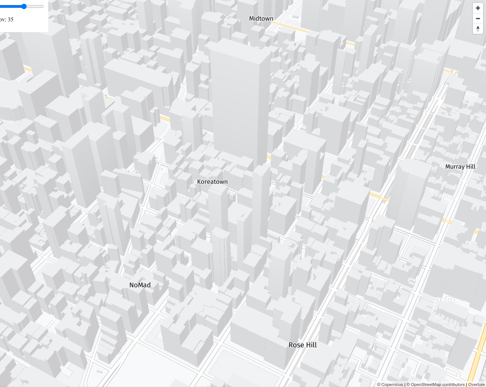

# field-of-view-demo
Field of view demo using MapLibre GL JS fill extrusions and Terrain3D

## Demos

### Fill Extrusion

https://wipfli.github.io/field-of-view-demo/fill-extrusion

### Terrain3D

https://wipfli.github.io/field-of-view-demo/terrain3d

